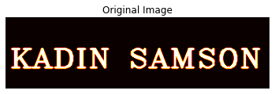
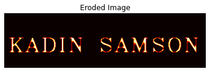
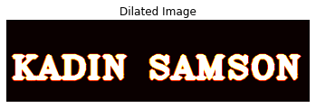

# Implementation-of-Erosion-and-Dilation
## Aim
To implement Erosion and Dilation using Python and OpenCV.
## Software Required
1. Anaconda - Python 3.7
2. OpenCV
## Algorithm:
### Step1:

Import the necessary packages.

### Step2:

Create the text image using cv2.putText().

### Step3:

Create the structuring kernel for image dilation and erosion.

### Step4:

Apply erosion and dilation using cv2.erode and cv2.dilate.

### Step5:

Plot the images using plt.imshow().

 
## Program:
```Python
Developed By: Kadin Samson L
Register  No: 212221230044
```

``` Python
# Import the necessary packages

import cv2
import numpy as np
from matplotlib import pyplot as plt

# Create the Text using cv2.putText

# Create the text using cv2.putText
text_image = np.zeros((100,250),dtype = 'uint8')
font = cv2.FONT_HERSHEY_COMPLEX_SMALL
cv2.putText(text_image,"KADIN SAMSON",(5,100),font,2,(255),2,cv2.LINE_AA) 
plt.title("Original Image")
plt.imshow(text_image,'hot')
plt.axis('off')

# Create the structuring element

kernel = cv2.getStructuringElement(cv2.MORPH_CROSS,(4,4))


# Erode the image

image_erode = cv2.erode(text_image,kernel)
plt.title("Eroded Image")
plt.imshow(image_erode,'hot')
plt.axis('off')


# Dilate the image

image_dilate = cv2.dilate(text_image,kernel)
plt.title("Dilated Image")
plt.imshow(image_dilate,'hot')
plt.axis('off')


```
## Output:

### Display the input Image



### Display the Eroded Image



### Display the Dilated Image



## Result
Thus the generated text image is eroded and dilated using python and OpenCV.